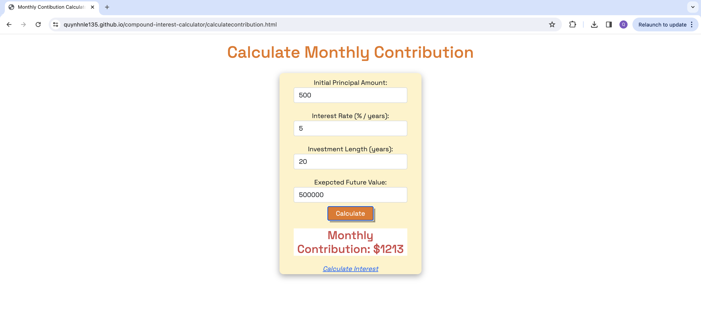

# Compound Interest Calculator 

# About The Project:

- The Compound Interest Calculator is a streamlined tool designed to offer two main features: 
    - Calculating the future value of an investment based on the principal amount, interest rate, monthly contributions, and duration; 
    - Determining the required monthly contribution to achieve a desired final amount, given the initial investment, interest rate, and investment period. 

- Built with HTML, CSS, Bootstrap 5, and JavaScript.

- You can use this calculator [here](https://quynhnle135.github.io/interest-calculator/calculatecontribution.html)

# Screenshot of This Project:

